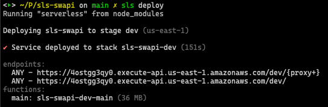

# Serverless SWAPI
<p align="center">
  <a href="http://nestjs.com/" target="blank"></a>
</p>

<p align="center">
  <a href="#" target="_blank"></a>
  <a href="#" target="_blank"></a>
  <a href="#" target="_blank"></a>
</p>

## Description
<p>
  Serverless microservice with hexagonal architecture, developed using Nest and documented with OpenAPI
</p>

## Diagram
<ul>
  <li>Client consumes the Api Gateway</li>
  <li>Api Gateway calls lambda</li>
  <li>Lambda processes the request on express server</li>
  <li>POST request consumes a DynamoDB table</li>
  <li>GET request searches the DynamoDB table; If it does not exist, it queries SWAPI and then saves it in the DynamoDB table</li>
</ul>


## Deploy the app
1. Clone the project
2. Install dependencies
```bash
$ npm install
```
3. Build the app 
```bash
$ npm run build
```
4. Configure the stage in the file ```serverless.yml```; default stage is ```dev```.
5. Deploy the app
```bash
$ sls deploy
```


6. Test the app


## Running the app in offline
1. Clone the project
2. Install dependencies
```bash
$ npm install
```
3. Build the app 
```bash
$ npm run build
```
4. Run docker file to get DynamoDB up locally
```bash
$ docker-compose up -d
```
5. Create the Characters table in local
```bash
$ aws dynamodb create-table --cli-input-json file://offline/migrations/characters.json --endpoint-url http://localhost:8000
```
5. Run the app
```bash
$ sls offline start
```


6. Test the app


## Documentation
<p>
  All endpoints documented using OpenAPI
</p>

### App Deployed
Go to ```http://{api_gateway_url}/docs``` for example ```https://4ostgg3qy0.execute-api.us-east-1.amazonaws.com/dev/docs```


### App Offline
Go to ```http://{aplication_url}/docs``` for example ```http://localhost:3000/dev/docs```


## Tests
<p>
  This microservice has unit tests and e2e tests
</p>

```bash
# unit tests
$ npm run test:unit

# e2e tests
$ npm run test:e2e
```

## Coverage
<p>
  This microservice has a coverage greater than 95%
</p>

```bash
# test coverage
$ npm run test:cov
```


## License
[AGPL licensed](LICENSE).
